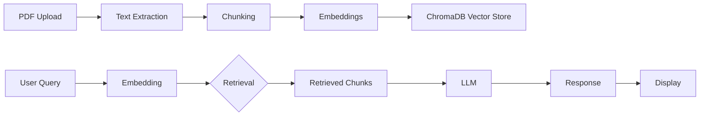

# Chat with PDF

[](https://www.python.org/downloads/)
[](https://opensource.org/licenses/MIT)

A powerful RAG (Retrieval-Augmented Generation) application that allows interactive conversations with PDF documents. Upload any PDF and ask questions to get accurate, context-aware answers powered by OpenAI or local Llama models.

## Features

- **PDF Upload & Processing**: Upload and process PDF documents of any size
- **Intelligent Question Answering**: Ask questions about PDF content
- **RAG-Powered Responses**: Accurate answers based on document content
- **Multiple LLM Support**: Works with OpenAI models and local Llama models
- **Real-time Processing**: Instant responses to queries
- **Context-Aware Answers**: Maintains conversation context
- **Vector Embeddings**: Semantic search through document content
- **Local & Cloud Models**: Support for both OpenAI and Ollama-based models

## Architecture



## Prerequisites

- Python 3.8 or higher
- OpenAI API key (for cloud models) OR
- Ollama running locally (for Llama models)

## Installation

1. Clone the repository:
```bash
git clone https://github.com/rchhabra13/01-ML-Projects-Collection.git
cd chat_with_pdf
```

2. Create and activate virtual environment:
```bash
python -m venv venv
source venv/bin/activate  # On Windows: venv\Scripts\activate
```

3. Install dependencies:
```bash
pip install -r requirements.txt
```

4. For OpenAI models (chat_pdf.py):
```bash
export OPENAI_API_KEY="your-api-key-here"
streamlit run chat_pdf.py
```

5. For Llama 3.2 local (chat_pdf_llama3.2.py):
```bash
# First, start Ollama
ollama run llama3.2

# In another terminal:
streamlit run chat_pdf_llama3.2.py
```

6. For Llama 3 local (chat_pdf_llama3.py):
```bash
# First, start Ollama
ollama run llama3:instruct

# In another terminal:
streamlit run chat_pdf_llama3.py
```

7. Access the application at `http://localhost:8501`

## Usage

### Upload and Query
1. Run the appropriate application (see Installation)
2. Enter your API key (for cloud models)
3. Upload a PDF document
4. Ask questions about the document
5. Get instant, context-aware answers

### Example Queries
- "What are the main findings in this research paper?"
- "Summarize the key points from the executive summary."
- "What methodology was used in this study?"
- "List all the dates mentioned in the PDF."
- "What are the main recommendations?"

## Technical Stack

- **Framework**: Embedchain for RAG orchestration
- **Vector Store**: ChromaDB for document embeddings
- **LLM Options**:
  - OpenAI GPT (cloud)
  - Llama 3 / 3.2 (local via Ollama)
- **Text Processing**: PDF parsing and chunking
- **UI**: Streamlit for interactive interface
- **Embeddings**: OpenAI or Ollama embeddings

## Configuration

### Environment Variables (.env)
```bash
OPENAI_API_KEY=sk-your-api-key-here
OLLAMA_BASE_URL=http://localhost:11434
```

### Model Selection

Edit the relevant file to customize:
- **chat_pdf.py**: Uses OpenAI models (GPT-3.5/GPT-4)
- **chat_pdf_llama3.2.py**: Uses Llama 3.2 with Ollama locally
- **chat_pdf_llama3.py**: Uses Llama 3 with Ollama locally

## Supported Document Types

- Research papers and studies
- Business reports and whitepapers
- Technical documentation
- Books and ebooks
- News articles
- Blog posts
- Policy documents
- Any text-based PDF file

## Troubleshooting

### Ollama Connection Issues
```bash
# Check if Ollama is running
curl http://localhost:11434/api/tags

# Pull a model
ollama pull llama3.2

# Run Ollama with verbose logging
OLLAMA_DEBUG=1 ollama serve
```

### API Key Errors
- Verify your OpenAI API key is valid
- Check that the key has sufficient quota
- Ensure no extra whitespace in the `.env` file

### Performance Issues
- Use smaller PDF files for initial testing
- Reduce chunk size for faster processing
- Use faster models (3.5 vs 4) for quicker responses

## Performance Features

- **Fast Processing**: Optimized for quick document processing
- **Memory Efficient**: Handles large documents efficiently
- **Local Processing**: All PDFs processed locally with Ollama option
- **Caching**: Intelligent caching for better performance

## Security & Privacy

- **Local Processing**: Documents processed locally (with Ollama option)
- **No Data Storage**: Documents are not permanently stored
- **API Security**: Secure API key management
- **Privacy Compliance**: Follows data privacy best practices

## Contributing

Contributions are welcome! Please:
1. Fork the repository
2. Create a feature branch (`git checkout -b feature/improvement`)
3. Make your changes
4. Add logging and error handling
5. Submit a pull request

## License

This project is licensed under the MIT License - see the [LICENSE](LICENSE) file for details.

## Support

For issues and questions:
- Create an issue on GitHub
- Check existing documentation
- Review the FAQ section

## Acknowledgments

- OpenAI for the language models
- Embedchain for the RAG framework
- Streamlit for the user interface
- Ollama for local model support
- ChromaDB for vector storage

---

**Author**: Rishi Chhabra ([@rchhabra13](https://github.com/rchhabra13))

**Note**: This application is designed for educational and research purposes. Always ensure you have the right to process and analyze the documents you upload.
